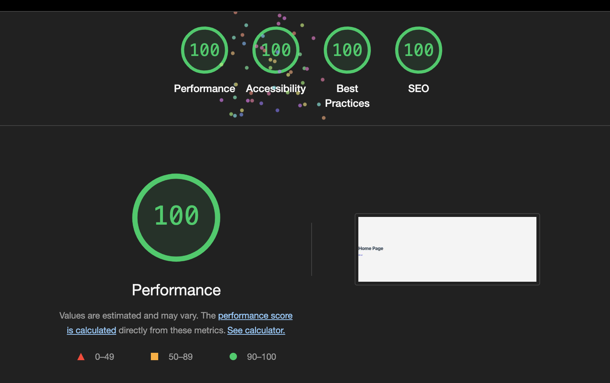
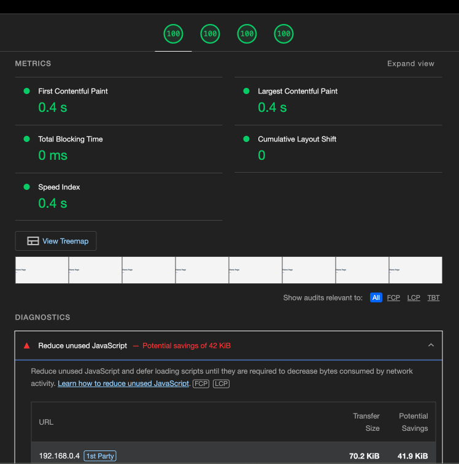

# vite-react-server-side-rendering

## Finished Project

### `main` branch

Vite + React + TypeScript + Server Side Rendering.

## How to run

`npm i` to install dependencies.

`npm run dev` to start the development server.

`npm run build` to build the project. This will generate a `dist` folder.

`npm run preview` to start the production server.

If you would like to contribute to me coffee fund: [Donate via PayPal](https://www.paypal.com/donate/?business=XNPNP5FWN4B2A&no_recurring=0&item_name=I+provide+free+computer+science+training+to+everyone&currency_code=USD)

## Why should you use Vite React.js SSR?

**pros**
- increase SEO ranking because the search engine crawlers use  most of the time no javascript interpretations (~70%)
- increase SEO ranking because it improves core web vitals

**cons**
- common issue with react.js - lighthouse already claims to reduce javascript for a blank project and suggests to use SSR, which is in place
- for SSR fetching other tools are needed like [vike](https://vike.dev)

## Differences to the original tutorial

- replace deprecated `react-router-dom` package with `react-router`

## Alternatives for Vite React.js SSR

- [Qwik](https://qwik.dev)
- [Next.js](https://nextjs.org)
- [Remix](https://remix.run/)

## Lighthouse messure

- all are 100%

- no blank page
- loads in 340ms
- ~70KB javascript

